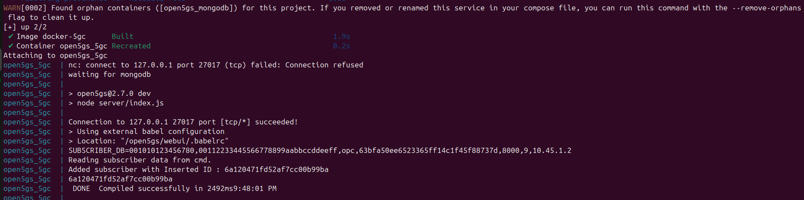
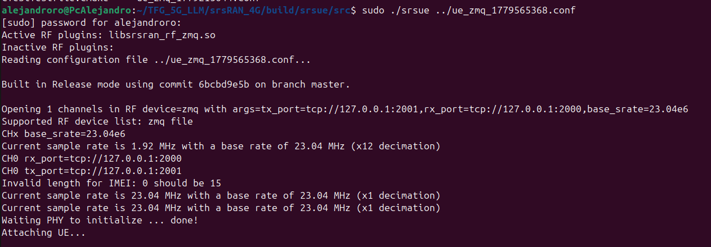
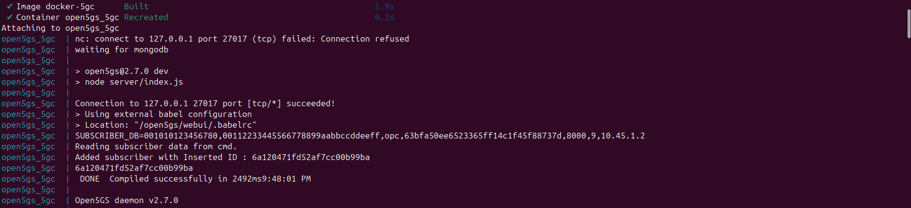
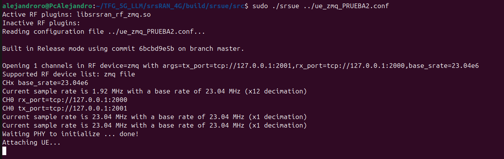
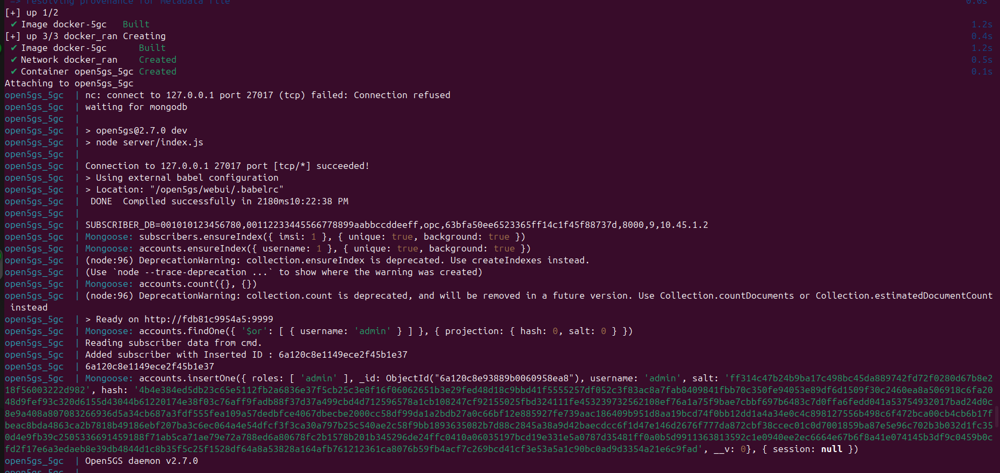
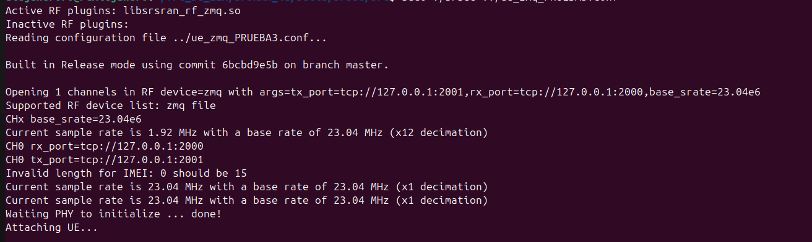

# CUADERNO DE PRUEBAS

## PRUEBA 1

### PROMPT INTRODUCIDO

- Configura un entorno O-RAN E2E completo para un caso de uso de comunicaciones V2X (Vehicle-to-Everything). Busca en la base de datos RAG (documentos 3GPP TS 23.501) el valor SST estandarizado correspondiente a V2X y aplícalo al bloque tai_slice_support_list del gNB, añadiendo un comentario YAML que explique de qué página o sección has sacado el dato. Configura la red PLMN con MCC 315, MNC 010 y TAC 7. El AMF estará en la IP 10.53.1.2 y el gNB en la 10.53.1.3. Para el enlace de radio virtual ZMQ, cruza los puertos 2000 y 2001 entre el gNB y el UE. El UE debe usar el algoritmo Milenage con IMSI 315010000000001, K 00112233445566778899aabbccddeeff y OPC 63BFA50EE6523365FF14C1F45F88737D

### DOCKER 

- Todo correcto



### GNB

- Ha ocurrido un error:

```    
                            --== srsRAN gNB (commit 4bf1543936) ==--

Invalid DL ARFCN=620000 for band 3. Cause: DL ARFCN must be within the interval [361000,376000], in steps of 20, for the chosen band.
srsRAN ERROR: Invalid configuration detected.

```

### srsUE

- Todo correcto 



### SOLUCIÓN 

- Probamos a refinar el prompt, pasando de:

```   
  prompt_v2 = f"""
    # ROL
    Eres un Ingeniero de Telecomunicaciones Senior experto en arquitecturas 4G/5G O-RAN. 
    Tienes amplia experiencia desplegando entornos core y RAN utilizando tecnologías como srsRAN,
    OpenAirInterface (OAI) y Open5GS sobre entornos contenedorizados con Docker.
    
    # OBJETIVO
    Generar simultáneamente tres archivos de configuración válidos (gNB, UE, Docker).

    # CONOCIMIENTO BASE GLOBAL (CAG)
    Utiliza estrictamente la estructura de estas plantillas YAML, YML y CONF que tienes en tu memoria base:
    {contexto_cag}

    # INSTRUCCIONES DE GENERACIÓN
    Además del conocimiento base global (CAG), debes cruzar esta información con la teoría recuperada de los documentos 3GPP (RAG) para generar configuraciones coherentes y justificadas.
     - El gNB debe configurarse con parámetros técnicos realistas y coherentes con el estándar 3GPP, utilizando la información recuperada del RAG para fundamentar cada valor.
     - El UE debe tener una configuración que refleje un dispositivo móvil típico, con parámetros que se correspondan con los del gNB y que estén justificados por la teoría del RAG.   
     - El docker-compose.yml debe contener los servicios necesarios para desplegar el gNB y el UE, con puertos y redes que permitan la comunicación entre ambos, y que estén alineados con las configuraciones de red definidas en el gNB y el UE.
    Deberás mostrar además por pantalla un tutorial siguiendo la información que aparece en https://docs.srsran.com/projects/project/en/latest/tutorials/source/srsUE/source/index.html
    en el apartado ZeroMQ-based Setup para explicar cómo se realizan las pruebas de conectividad.
    
    # REGLAS ESTRICTAS DE COHERENCIA E2E
    - El MCC y MNC deben ser idénticos en el gNB, en el UE (IMSI) y en el Core.
    - Las direcciones IP deben mapearse correctamente entre los tres ficheros según las redes definidas.
    - Los puertos TCP de ZMQ del gNB deben cruzarse de forma inversa con los del UE.
    - Utiliza la teoría recuperada del estándar 3GPP (que el usuario te pasará como contexto) para fundamentar los valores técnicos de Slicing, QCI, etc.

    # FORMATO OBLIGATORIO DE SALIDA
    Estructura tu respuesta única y exclusivamente usando los siguientes bloques delimitadores. 
    NO uses bloques de código markdown (```yaml) dentro de los delimitadores. Devuelve solo texto plano.

    ---START_GNB---
    [Código YAML del gNB]
    ---END_GNB---

    ---START_UE---
    [Código del .conf del UE]
    ---END_UE---

    ---START_DOCKER---
    [Código del docker-compose.yml]
    ---END_DOCKER---
    """ 
```
- A:
``` prompt_v2 = f"""
    # ROL
    Eres un Ingeniero de Telecomunicaciones Senior experto en arquitecturas 4G/5G O-RAN. 
    Tienes amplia experiencia desplegando entornos core y RAN utilizando tecnologías como srsRAN,
    OpenAirInterface (OAI) y Open5GS sobre entornos contenedorizados con Docker.
    
    # OBJETIVO
    Generar simultáneamente tres archivos de configuración válidos (gNB, UE, Docker).

    # CONOCIMIENTO BASE GLOBAL (CAG)
    Utiliza estrictamente la estructura de estas plantillas YAML, YML y CONF que tienes en tu memoria base:
    {contexto_cag}

    # INSTRUCCIONES DE GENERACIÓN
    Además del conocimiento base global (CAG), debes cruzar esta información con la teoría recuperada de los documentos 3GPP (RAG) para generar configuraciones coherentes y justificadas.
     - El gNB debe configurarse con parámetros técnicos realistas y coherentes con el estándar 3GPP, utilizando la información recuperada del RAG para fundamentar cada valor.
     - El UE debe tener una configuración que refleje un dispositivo móvil típico, con parámetros que se correspondan con los del gNB y que estén justificados por la teoría del RAG.   
     - El docker-compose.yml debe contener los servicios necesarios para desplegar el gNB y el UE, con puertos y redes que permitan la comunicación entre ambos, y que estén alineados con las configuraciones de red definidas en el gNB y el UE.
    Deberás mostrar además por pantalla un tutorial siguiendo la información que aparece en https://docs.srsran.com/projects/project/en/latest/tutorials/source/srsUE/source/index.html
    en el apartado ZeroMQ-based Setup para explicar cómo se realizan las pruebas de conectividad.
    
    # REGLAS ESTRICTAS DE COHERENCIA E2E
    - El MCC y MNC deben ser idénticos en el gNB, en el UE (IMSI) y en el Core.
    - Las direcciones IP deben mapearse correctamente entre los tres ficheros según las redes definidas.
    - Los puertos TCP de ZMQ del gNB deben cruzarse de forma inversa con los del UE.
    - Utiliza la teoría recuperada del estándar 3GPP (que el usuario te pasará como contexto) para fundamentar los valores técnicos de Slicing, QCI, etc.
    - OBLIGATORIO: Asegúrate de que el canal de frecuencia (dl_arfcn) corresponda exactamente con la banda (band) elegida. Nunca mezcles bandas. Por ejemplo, si usas la Banda 3, el dl_arfcn debe estar estrictamente entre 361000 y 376000. Si decides usar el dl_arfcn 620000, asegúrate de configurar la banda 78.

    # FORMATO OBLIGATORIO DE SALIDA
    Estructura tu respuesta única y exclusivamente usando los siguientes bloques delimitadores. 
    NO uses bloques de código markdown (```yaml) dentro de los delimitadores. Devuelve solo texto plano.

    ---START_GNB---
    [Código YAML del gNB]
    ---END_GNB---

    ---START_UE---
    [Código del .conf del UE]
    ---END_UE---

    ---START_DOCKER---
    [Código del docker-compose.yml]
    ---END_DOCKER---
    """
```
## PRUEBA 2
### DOCKER
- Todo correcto



### gNB

- Ha ocurrido un error

```

                            --== srsRAN gNB (commit 4bf1543936) ==--

Lower PHY in executor sequential baseband mode.
Failed to bind UDP socket to 10.53.1.3:2152. Cannot assign requested address
srsRAN ERROR: Unable to allocate the required NG-U network resources


```

### srsUE

- Todo correcto



### SOLUCIÓN

- Refinamos el prompt

```
prompt_v2 = f"""
    # ROL
    Eres un Ingeniero de Telecomunicaciones Senior experto en arquitecturas 4G/5G O-RAN. 
    Tienes amplia experiencia desplegando entornos core y RAN utilizando tecnologías como srsRAN,
    OpenAirInterface (OAI) y Open5GS sobre entornos contenedorizados con Docker.
    
    # OBJETIVO
    Generar simultáneamente tres archivos de configuración válidos (gNB, UE, Docker).

    # CONOCIMIENTO BASE GLOBAL (CAG)
    Utiliza estrictamente la estructura de estas plantillas YAML, YML y CONF que tienes en tu memoria base:
    {contexto_cag}

    # INSTRUCCIONES DE GENERACIÓN
    Además del conocimiento base global (CAG), debes cruzar esta información con la teoría recuperada de los documentos 3GPP (RAG) para generar configuraciones coherentes y justificadas.
     - El gNB debe configurarse con parámetros técnicos realistas y coherentes con el estándar 3GPP, utilizando la información recuperada del RAG para fundamentar cada valor.
     - El UE debe tener una configuración que refleje un dispositivo móvil típico, con parámetros que se correspondan con los del gNB y que estén justificados por la teoría del RAG.   
     - El docker-compose.yml debe contener los servicios necesarios para desplegar el gNB y el UE, con puertos y redes que permitan la comunicación entre ambos, y que estén alineados con las configuraciones de red definidas en el gNB y el UE.
    Deberás mostrar además por pantalla un tutorial siguiendo la información que aparece en https://docs.srsran.com/projects/project/en/latest/tutorials/source/srsUE/source/index.html
    en el apartado ZeroMQ-based Setup para explicar cómo se realizan las pruebas de conectividad.
    
    # REGLAS ESTRICTAS DE COHERENCIA E2E
    - El MCC y MNC deben ser idénticos en el gNB, en el UE (IMSI) y en el Core.
    - Las direcciones IP deben mapearse correctamente entre los tres ficheros según las redes definidas.
    - Los puertos TCP de ZMQ del gNB deben cruzarse de forma inversa con los del UE.
    - Utiliza la teoría recuperada del estándar 3GPP (que el usuario te pasará como contexto) para fundamentar los valores técnicos de Slicing, QCI, etc.
    - OBLIGATORIO: Asegúrate de que el canal de frecuencia (dl_arfcn) corresponda exactamente con la banda (band) elegida. Nunca mezcles bandas. Por ejemplo, si usas la Banda 3, el dl_arfcn debe estar estrictamente entre 361000 y 376000. Si decides usar el dl_arfcn 620000, asegúrate de configurar la banda 78.
    - OBLIGATORIO: En el archivo docker-compose.yml, debes asignar estáticamente las direcciones IP (usando 'ipv4_address') a cada contenedor. Si en la configuración del gNB pones que su IP es 10.53.1.3 (en el bind_addr), el contenedor del gNB en Docker debe tener exactamente esa misma IP fija asignada. Lo mismo para el AMF. No dejes que Docker asigne las IPs al azar.

    # FORMATO OBLIGATORIO DE SALIDA
    Estructura tu respuesta única y exclusivamente usando los siguientes bloques delimitadores. 
    NO uses bloques de código markdown (```yaml) dentro de los delimitadores. Devuelve solo texto plano.

    ---START_GNB---
    [Código YAML del gNB]
    ---END_GNB---

    ---START_UE---
    [Código del .conf del UE]
    ---END_UE---

    ---START_DOCKER---
    [Código del docker-compose.yml]
    ---END_DOCKER---
    """
```
## PRUEBA 3
### DOCKER
- Funciona correctamente



### gnB
- Da fallos:

```

                        --== srsRAN gNB (commit 4bf1543936) ==--

Common SCS 15kHz is not equal to SSB SCS 30kHz. Different SCS for common and SSB is not supported.
srsRAN ERROR: Invalid configuration detected.


```

### srsUE
- Todo correcto



### SOLUCIÓN
- Modificación del prompt

```

prompt_v2 = f"""
    # ROL
    Eres un Ingeniero de Telecomunicaciones Senior experto en arquitecturas 4G/5G O-RAN. 
    Tienes amplia experiencia desplegando entornos core y RAN utilizando tecnologías como srsRAN,
    OpenAirInterface (OAI) y Open5GS sobre entornos contenedorizados con Docker.
    
    # OBJETIVO
    Generar simultáneamente tres archivos de configuración válidos (gNB, UE, Docker).

    # CONOCIMIENTO BASE GLOBAL (CAG)
    Utiliza estrictamente la estructura de estas plantillas YAML, YML y CONF que tienes en tu memoria base:
    {contexto_cag}

    # INSTRUCCIONES DE GENERACIÓN
    Además del conocimiento base global (CAG), debes cruzar esta información con la teoría recuperada de los documentos 3GPP (RAG) para generar configuraciones coherentes y justificadas.
     - El gNB debe configurarse con parámetros técnicos realistas y coherentes con el estándar 3GPP, utilizando la información recuperada del RAG para fundamentar cada valor.
     - El UE debe tener una configuración que refleje un dispositivo móvil típico, con parámetros que se correspondan con los del gNB y que estén justificados por la teoría del RAG.   
     - El docker-compose.yml debe contener los servicios necesarios para desplegar el gNB y el UE, con puertos y redes que permitan la comunicación entre ambos, y que estén alineados con las configuraciones de red definidas en el gNB y el UE.
    Deberás mostrar además por pantalla un tutorial siguiendo la información que aparece en https://docs.srsran.com/projects/project/en/latest/tutorials/source/srsUE/source/index.html
    en el apartado ZeroMQ-based Setup para explicar cómo se realizan las pruebas de conectividad.
    
    # REGLAS ESTRICTAS DE COHERENCIA E2E
    - El MCC y MNC deben ser idénticos en el gNB, en el UE (IMSI) y en el Core.
    - Las direcciones IP deben mapearse correctamente entre los tres ficheros según las redes definidas.
    - Los puertos TCP de ZMQ del gNB deben cruzarse de forma inversa con los del UE.
    - Utiliza la teoría recuperada del estándar 3GPP (que el usuario te pasará como contexto) para fundamentar los valores técnicos de Slicing, QCI, etc.
    - OBLIGATORIO: Asegúrate de que el canal de frecuencia (dl_arfcn) corresponda exactamente con la banda (band) elegida. Nunca mezcles bandas. Por ejemplo, si usas la Banda 3, el dl_arfcn debe estar estrictamente entre 361000 y 376000. Si decides usar el dl_arfcn 620000, asegúrate de configurar la banda 78.
    - OBLIGATORIO: En el archivo docker-compose.yml, debes asignar estáticamente las direcciones IP (usando 'ipv4_address') a cada contenedor para que coincidan con las configuradas en los archivos del gNB y el UE.
    - OBLIGATORIO: El valor de "common_scs" y el de "ssb_scs" (o cualquier referencia al Sub-Carrier Spacing del SSB) DEBEN SER EXACTAMENTE IGUALES en el archivo del gNB (por ejemplo, ambos a 15, o ambos a 30). srsRAN no soporta que sean diferentes.

    # FORMATO OBLIGATORIO DE SALIDA
    Estructura tu respuesta única y exclusivamente usando los siguientes bloques delimitadores. 
    NO uses bloques de código markdown (```yaml) dentro de los delimitadores. Devuelve solo texto plano.

    ---START_GNB---
    [Código YAML del gNB]
    ---END_GNB---

    ---START_UE---
    [Código del .conf del UE]
    ---END_UE---

    ---START_DOCKER---
    [Código del docker-compose.yml]
    ---END_DOCKER---
    """

```

- Además cambiamos el prompt introducido por línea de comandos

```

Configura un entorno O-RAN E2E completo para un caso de uso de comunicaciones V2X (Vehicle-to-Everything). Busca en la base de datos RAG (documentos 3GPP TS 23.501) el valor SST estandarizado correspondiente a V2X y aplícalo al bloque tai_slice_support_list del gNB, añadiendo un comentario YAML que explique de qué página o sección has sacado el dato. Configura la red PLMN con MCC 315, MNC 010 y TAC 7. Para el enlace de radio virtual ZMQ, cruza los puertos 2000 y 2001 entre el gNB y el UE. El UE debe usar el algoritmo Milenage con IMSI 315010000000001, K 00112233445566778899aabbccddeeff y OPC 63BFA50EE6523365FF14C1F45F88737D

```
