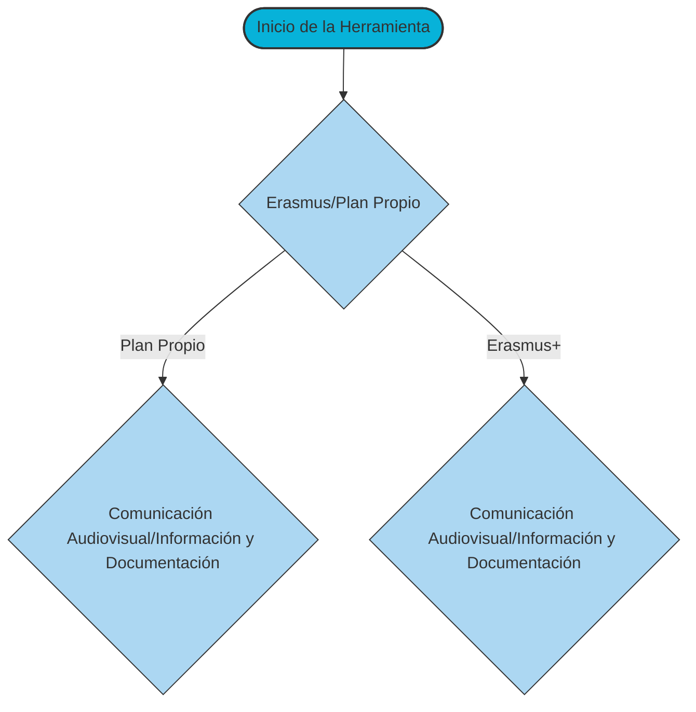

```mermaid
flowchart
    classDef startEnd fill:#07B2D9,stroke:#333,stroke-width:2px;
    classDef process fill:#ACD7F2,stroke:#333,stroke-width:1px;
    classDef decision fill:#75BAE1,stroke:#333,stroke-width:1px;
    classDef database fill:#bbb651,stroke:#333,stroke-width:1px;
    classDef error fill:#fccccc,stroke:#333,stroke-width:1px;
    
    A([Inicio de la Herramienta]) --> B{Erasmus/Plan Propio}
    B -- Plan Propio --> C{Comunicación Audiovisual/Información y Documentación}
    B -- Erasmus+ --> D{Comunicación Audiovisual/Información y Documentación}

    class A startEnd;
    class B,C,D process;    

```