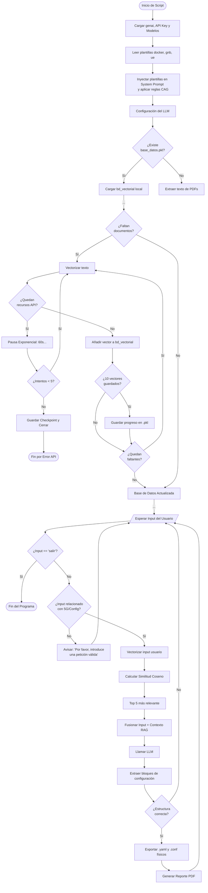

```mermaid
graph TD
    Start([Inicio de Script]) --> Init[Cargar genai, API Key y Modelos]
    Init --> CAG_Read[Leer plantillas docker, gnb, ue ]
    CAG_Read --> CAG_Prompt[Inyectar plantillas en System Prompt <br> y aplicar reglas CAG]
    CAG_Prompt --> CAG_Config[Configuración del LLM]

    CAG_Config --> Check_DB{¿Existe <br>base_datos.pkl?}
    Check_DB -- Sí --> Load_DB[Cargar bd_vectorial local]
    Check_DB -- No --> Extract_PDF[Extraer texto de PDFs]
    Load_DB --  ... --> Missing_Docs{¿Faltan <br> documentos?}
    Missing_Docs -- Sí --> Embed_Loop[Vectorizar texto]
    

    Embed_Loop --> Error_Check{¿Quedan <br> recursos API?}
    Error_Check -- Sí --> Backoff[Pausa Exponencial: 60s...]
    Backoff --> Max_Retries{¿Intentos < 5?}
    Max_Retries -- Sí --> Embed_Loop
    Max_Retries -- No --> Save_Crash[Guardar Checkpoint y Cerrar]
    Save_Crash --> End_Crash([Fin por Error API])
    
    Error_Check -- No --> Save_Vector[Añadir vector a bd_vectorial]
    Save_Vector --> Checkpoint{¿10 vectores <br> guardados?}
    Checkpoint -- Sí --> Dump_DB[Guardar progreso en .pkl]
    Checkpoint -- No --> Next_Doc{¿Quedan <br> faltantes?}
    Dump_DB --> Next_Doc
    Next_Doc -- Sí --> Embed_Loop
    
    Next_Doc -- No --> RAG_Ready
    Missing_Docs -- No --> RAG_Ready[Base de Datos Actualizada]
    
    RAG_Ready -- ... --> User_Input[/Esperar Input del Usuario/]
    User_Input --> Check_Exit{¿Input == 'salir'?}
    Check_Exit -- Sí --> End_Clean([Fin del Programa])
    
    Check_Exit -- No --> Check_Context{¿Input relacionado <br> con 5G/Config?}
    Check_Context -- No --> Warn_User[Avisar: 'Por favor, introduce <br> una petición válida']
    Warn_User --> User_Input
    
    Check_Context -- Sí --> Embed_Input[Vectorizar input usuario]
    Embed_Input --> Cos_Sim[Calcular Similitud Coseno]
    Cos_Sim --> Top_5[Top 5 más relevante]
    Top_5 --> Prompt_Fusion[Fusionar Input + Contexto RAG]
    
    Prompt_Fusion --> LLM_Call[Llamar LLM]
    LLM_Call --> Parse_Response[Extraer bloques de configuración]
    Parse_Response --> Check_Output{¿Estructura <br> correcta?}
    
    Check_Output -- No --> User_Input
    Check_Output -- Sí --> Save_Files[Exportar .yaml y .conf físicos]
    Save_Files --> Generate_PDF[Generar Reporte PDF]
    Generate_PDF --> User_Input


    class Init,CAG_Read,CAG_Prompt,CAG_Config cag;
    class Check_DB,Load_DB,Extract_PDF,Filter_Docs,Embed_Loop,Save_Vector,Dump_DB rag;
    class Embed_Input,Cos_Sim,Top_5,Prompt_Fusion,LLM_Call llm;
    class User_Input,Save_Files,Generate_PDF io;
    class Check_Context,Warn_User warning;
```