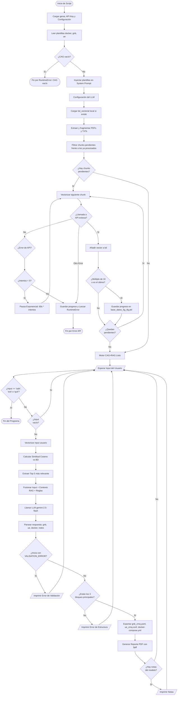

```mermaid
graph TD
    Start([Inicio de Script]) --> Init[Cargar genai, API Key y Configuración]
    
    Init --> CAG_Read[Leer plantillas docker, gnb, ue]
    CAG_Read --> Check_CAG{¿CAG vacío?}
    Check_CAG -- Sí --> RuntimeError_CAG([Fin por RuntimeError: CAG vacío])
    Check_CAG -- No --> CAG_Prompt[Inyectar plantillas en System Prompt]
    CAG_Prompt --> CAG_Config[Configuración del LLM]

    CAG_Config --> Load_DB[Cargar bd_vectorial local si existe]
    Load_DB --> Extract_Docs[Extraer y fragmentar PDFs y TXTs]
    Extract_Docs --> Filter_Docs[Filtrar chunks pendientes frente a los ya procesados]
    
    Filter_Docs --> Missing_Docs{¿Hay chunks <br> pendientes?}
    Missing_Docs -- Sí --> Embed_Loop[Vectorizar siguiente chunk]
    
    Embed_Loop --> Embed_Try{¿Llamada a <br> API exitosa?}
    
    Embed_Try -- No --> API_Error{¿Error de API?}
    API_Error --> Max_Retries{¿Intentos < 5?}
    Max_Retries -- Sí --> Backoff[Pausa Exponencial: 60s * intentos] --> Embed_Loop
    Max_Retries -- No --> Save_Crash[Guardar progreso y Lanzar RuntimeError] --> End_Crash([Fin por Error API])
    Embed_Try -- Otro Error --> Save_Crash
    
    Embed_Try -- Sí --> Save_Vector[Añadir vector a bd]
    Save_Vector --> Checkpoint{¿Múltiplo de 10 <br> o es el último?}
    Checkpoint -- Sí --> Dump_DB[Guardar progreso en base_datos_5g_tfg.pkl]
    Checkpoint -- No --> Next_Doc{¿Quedan <br> pendientes?}
    Dump_DB --> Next_Doc
    
    Next_Doc -- Sí --> Embed_Loop
    Next_Doc -- No --> RAG_Ready[Motor CAG+RAG Listo]
    Missing_Docs -- No --> RAG_Ready
    
    RAG_Ready --> User_Input[/Esperar Input del Usuario/]
    
    User_Input --> Check_Exit{¿Input == 'salir', <br> 'exit' o 'quit'?}
    Check_Exit -- Sí --> End_Clean([Fin del Programa])
    
    Check_Exit -- No --> Check_Empty{¿Input <br> vacío?}
    Check_Empty -- Sí --> User_Input
    
    Check_Empty -- No --> Embed_Input[Vectorizar input usuario]
    Embed_Input --> Cos_Sim[Calcular Similitud Coseno vs BD]
    Cos_Sim --> Top_5[Extraer Top 5 más relevante]
    Top_5 --> Prompt_Fusion[Fusionar Input + Contexto RAG + Reglas]
    
    Prompt_Fusion --> LLM_Call[Llamar LLM gemini-2.5-flash]
    LLM_Call --> Parse_Response[Parsear respuesta: gnb, ue, docker, notes]
    
    Parse_Response --> Check_Val_Error{¿Inicia con <br> VALIDATION_ERROR?}
    Check_Val_Error -- Sí --> Print_Val_Error[/Imprimir Error de Validación/] --> User_Input
    
    Check_Val_Error -- No --> Check_Output{¿Están los 3 <br> bloques principales?}
    Check_Output -- No --> Print_Struct_Error[/Imprimir Error de Estructura/] --> User_Input
    
    Check_Output -- Sí --> Save_Files[Exportar gnb_zmq.yaml, ue_zmq.conf, docker-compose.yml]
    Save_Files --> Generate_PDF[Generar Reporte PDF con fpdf]
    Generate_PDF --> Check_Notes{¿Hay notas <br> del modelo?}
    Check_Notes -- Sí --> Print_Notes[/Imprimir Notas/] --> User_Input
    Check_Notes -- No --> User_Input


    class Init,CAG_Read,Check_CAG,CAG_Prompt,CAG_Config cag;
    class Load_DB,Extract_Docs,Filter_Docs,Missing_Docs,Embed_Loop,Embed_Try,Max_Retries,Backoff,Save_Vector,Checkpoint,Dump_DB,Next_Doc rag;
    class Embed_Input,Cos_Sim,Top_5,Prompt_Fusion,LLM_Call llm;
    class User_Input,Save_Files,Generate_PDF,Print_Notes,Print_Val_Error,Print_Struct_Error io;
    class Check_Empty,Check_Exit,Check_Val_Error,Check_Output,Check_Notes warning;
```