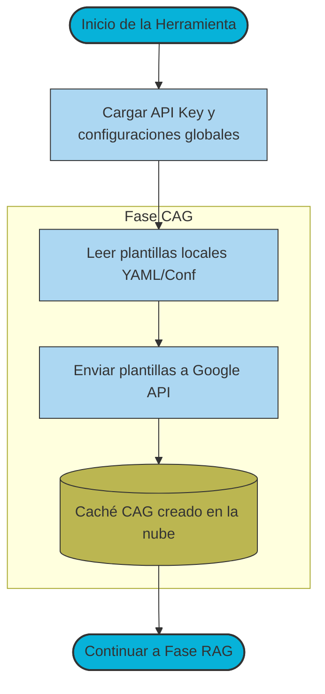
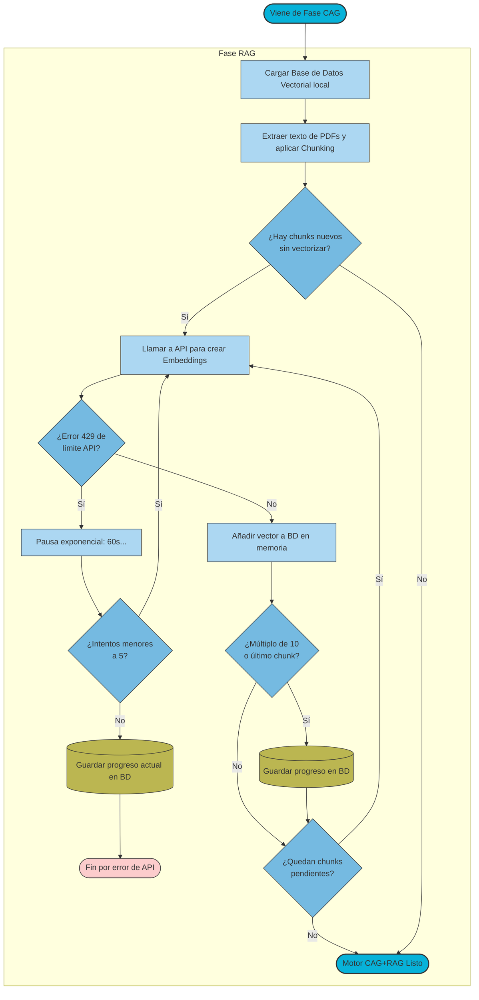
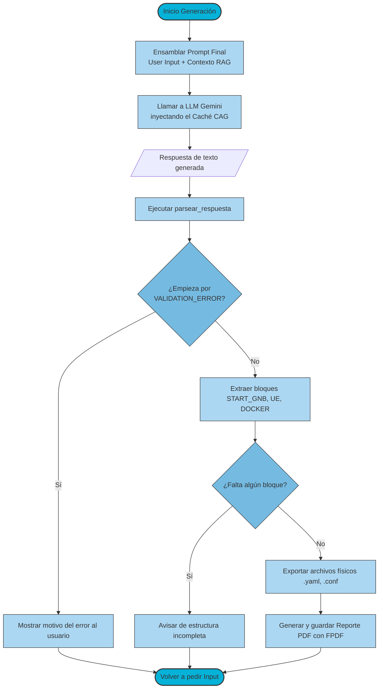

```mermaid
flowchart 
    %% Definición de estilos
    classDef startEnd fill:#07B2D9,stroke:#333,stroke-width:2px;
    classDef process fill:#ACD7F2,stroke:#333,stroke-width:1px;
    classDef decision fill:#75BAE1,stroke:#333,stroke-width:1px;
    classDef database fill:#bbb651,stroke:#333,stroke-width:1px;
    classDef error fill:#fccccc,stroke:#333,stroke-width:1px;

    %% Conexiones y Nodos
    A([Inicio de la Herramienta]) --> B[Cargar API Key y<br>configuraciones globales]
    
    subgraph Fase CAG
        
        C[Leer plantillas locales YAML/Conf] --> D[Enviar plantillas a Google API]
        D --> E[(Caché CAG creado en la nube)]
    end

    B --> C
    E --> Z([Continuar a Fase RAG])

    %% Asignación de Clases
    class A,Z startEnd;
    class B,C,D process;
    class E database;


```

```mermaid
flowchart TD
    %% Definición de estilos
    classDef startEnd fill:#07B2D9,stroke:#333,stroke-width:2px;
    classDef process fill:#ACD7F2,stroke:#333,stroke-width:1px;
    classDef decision fill:#75BAE1,stroke:#333,stroke-width:1px;
    classDef database fill:#bbb651,stroke:#333,stroke-width:1px;
    classDef error fill:#fccccc,stroke:#333,stroke-width:1px;

    %% Nodo conector
    A2([Viene de Fase CAG]) --> F

    subgraph Fase RAG
        direction LR
        F[Cargar Base de Datos Vectorial local] --> G[Extraer texto de PDFs y aplicar Chunking]
        G --> I{¿Hay chunks nuevos<br>sin vectorizar?}
        
        I -- Sí --> J[Llamar a API para crear Embeddings]
        
        J --> K{¿Error 429 de<br>límite API?}
        K -- Sí --> L[Pausa exponencial: 60s...]
        L --> M{¿Intentos menores<br>a 5?}
        M -- Sí --> J
        M -- No --> P[(Guardar progreso actual en BD)]
        P --> Q([Fin por error de API])
        
        K -- No --> R[Añadir vector a BD en memoria]
        R --> S{¿Múltiplo de 10<br>o último chunk?}
        S -- Sí --> T[(Guardar progreso en BD)]
        S -- No --> U
        T --> U{¿Quedan chunks<br>pendientes?}
        U -- Sí --> J
        U -- No --> V
        
        I -- No --> V
    end

    V([Motor CAG+RAG Listo])

    %% Asignación de Clases
    class A2,V startEnd;
    class F,G,J,L,R process;
    class I,K,M,S,U decision;
    class P,T database;
    class Q error;
```

```mermaid
flowchart TD
    %% Definición de estilos
    classDef startEnd fill:#07B2D9,stroke:#333,stroke-width:2px;
    classDef process fill:#ACD7F2,stroke:#333,stroke-width:1px;
    classDef decision fill:#75BAE1,stroke:#333,stroke-width:1px;
    classDef database fill:#bbb651,stroke:#333,stroke-width:1px;
    classDef error fill:#fccccc,stroke:#333,stroke-width:1px;

    %% Conexiones y Nodos
    A([Esperando Input]) --> B[/El usuario introduce su petición/]
    B --> C{¿Input=='salir'?}
    C -- Sí --> D([Fin de la ejecución])
    C -- No --> E{¿Input relacionado <br> con 5G/Config?}
    E -- Sí --> E2[Vectorizar input usuario]
    E2 --> G[Calcular Similitud Coseno]
    E -- No --> F[Avisar: 'Por favor, introduce <br> una petición válida']
    F --> A
    G --> H[Ordenar resultados y extraer TOP_5 chunks]
    H --> I[/Contexto RAG ensamblado/]
    I --> J([Pasar a fase de Generación])

    %% Asignación de Clases (Limpias y al final)
    class A,D,J startEnd;
    class F,G,H process;
    class C,E,E2 decision;
    class B,I inputOutput;
```

```mermaid
flowchart TD
    %% Definición de estilos
    classDef startEnd fill:#07B2D9,stroke:#333,stroke-width:2px;
    classDef process fill:#ACD7F2,stroke:#333,stroke-width:1px;
    classDef decision fill:#75BAE1,stroke:#333,stroke-width:1px;
    classDef database fill:#bbb651,stroke:#333,stroke-width:1px;
    classDef error fill:#fccccc,stroke:#333,stroke-width:1px;

    %% Conexiones y Nodos
    A([Inicio Generación]) --> B[Ensamblar Prompt Final<br>User Input + Contexto RAG]
    B --> C[Llamar a LLM Gemini<br>inyectando el Caché CAG]
    C --> D[/Respuesta de texto generada/]
    
    D --> E[Ejecutar parsear_respuesta]
    E --> F{¿Empieza por<br>VALIDATION_ERROR?}
    
    F -- Sí --> G[Mostrar motivo del error al usuario]
    G --> L([Volver a pedir Input])
    
    F -- No --> H[Extraer bloques START_GNB, UE, DOCKER]
    H --> I{¿Falta algún bloque?}
    I -- Sí --> J[Avisar de estructura incompleta]
    J --> L
    
    I -- No --> K[Exportar archivos físicos .yaml, .conf]
    K --> M[Generar y guardar Reporte PDF con FPDF]
    M --> L

    %% Asignación de Clases (Limpias y al final)
    class A,L startEnd;
    class B,C,E,G,H,J,K,M process;
    class F,I decision;
    class D inputOutput;
```