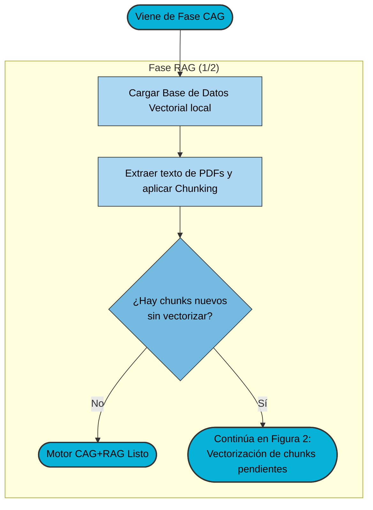
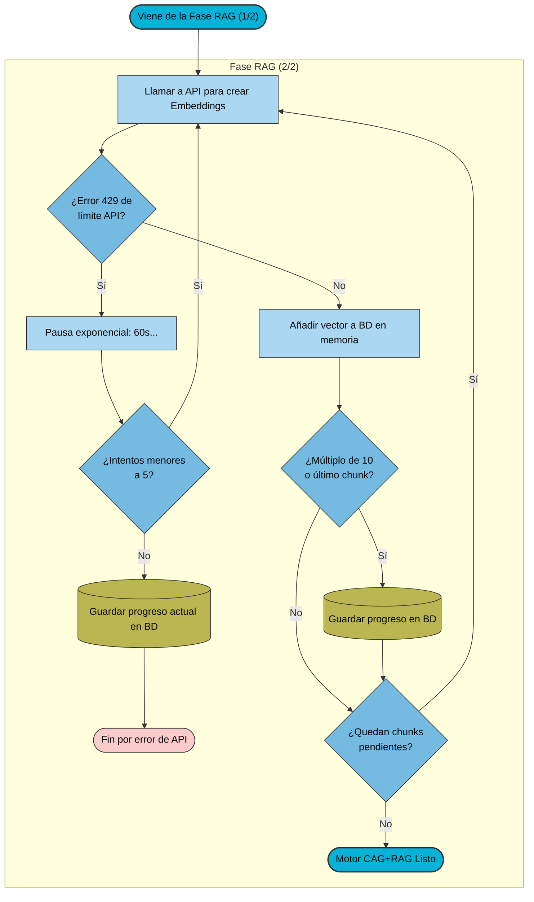
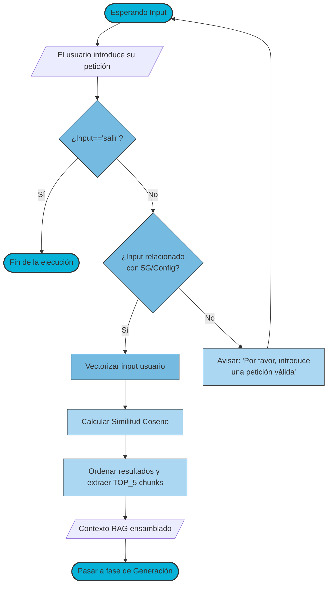
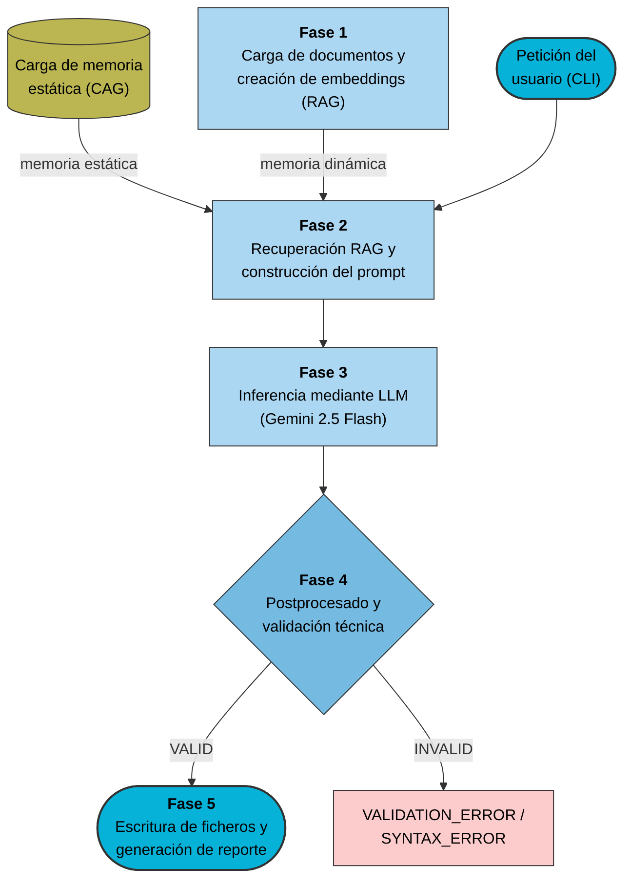
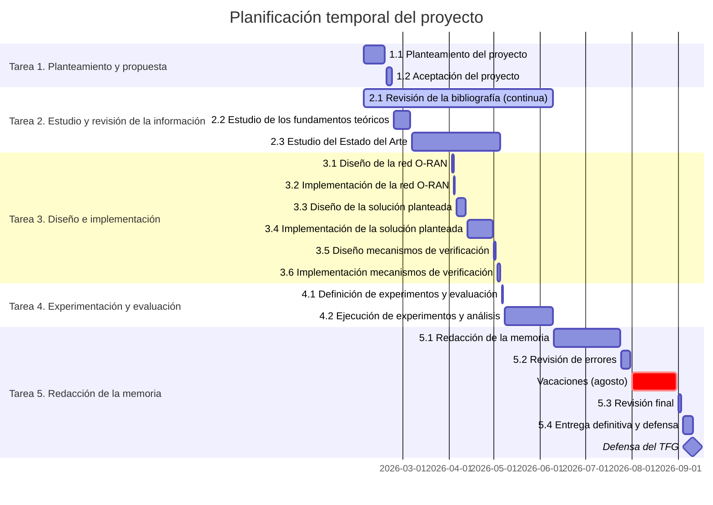

```mermaid
flowchart 
    %% Definición de estilos
    classDef startEnd fill:#07B2D9,stroke:#333,stroke-width:2px;
    classDef process fill:#ACD7F2,stroke:#333,stroke-width:1px;
    classDef decision fill:#75BAE1,stroke:#333,stroke-width:1px;
    classDef database fill:#bbb651,stroke:#333,stroke-width:1px;
    classDef error fill:#fccccc,stroke:#333,stroke-width:1px;

    %% Conexiones y Nodos
    A([Inicio de la Herramienta]) --> B[Cargar API Key y<br>configuraciones globales]
    
    subgraph Fase CAG
        
        C[Leer plantillas locales YAML/Conf] --> D[Enviar plantillas a Google API]
        D --> E[(Caché CAG creado en la nube)]
    end

    B --> C
    E --> Z([Continuar a Fase RAG])

    %% Asignación de Clases
    class A,Z startEnd;
    class B,C,D process;
    class E database;


```

```mermaid
flowchart TD
    %% Definición de estilos
    classDef startEnd fill:#07B2D9,stroke:#333,stroke-width:2px;
    classDef process fill:#ACD7F2,stroke:#333,stroke-width:1px;
    classDef decision fill:#75BAE1,stroke:#333,stroke-width:1px;
    classDef database fill:#bbb651,stroke:#333,stroke-width:1px;
    classDef error fill:#fccccc,stroke:#333,stroke-width:1px;

    %% Nodo conector
    A2([Viene de Fase CAG]) --> F

    subgraph Fase RAG
        F[Cargar Base de Datos Vectorial local] --> G[Extraer texto de PDFs y aplicar Chunking]
        G --> I{¿Hay chunks nuevos<br>sin vectorizar?}
        
        I -- Sí --> J[Llamar a API para crear Embeddings]
        
        J --> K{¿Error 429 de<br>límite API?}
        K -- Sí --> L[Pausa exponencial: 60s...]
        L --> M{¿Intentos menores<br>a 5?}
        M -- Sí --> J
        M -- No --> P[(Guardar progreso actual en BD)]
        P --> Q([Fin por error de API])
        
        K -- No --> R[Añadir vector a BD en memoria]
        R --> S{¿Múltiplo de 10<br>o último chunk?}
        S -- Sí --> T[(Guardar progreso en BD)]
        S -- No --> U
        T --> U{¿Quedan chunks<br>pendientes?}
        U -- Sí --> J
        U -- No --> V
        
        I -- No --> V
    end

    V([Motor CAG+RAG Listo])

    %% Asignación de Clases
    class A2,V startEnd;
    class F,G,J,L,R process;
    class I,K,M,S,U decision;
    class P,T database;
    class Q error;
```

```mermaid
flowchart TD
    %% Definición de estilos
    classDef startEnd fill:#07B2D9,stroke:#333,stroke-width:2px,color:#000;
    classDef process fill:#ACD7F2,stroke:#333,stroke-width:1px,color:#000;
    classDef decision fill:#75BAE1,stroke:#333,stroke-width:1px,color:#000;
    classDef database fill:#bbb651,stroke:#333,stroke-width:1px,color:#000;
    classDef error fill:#fccccc,stroke:#333,stroke-width:1px,color:#000;
 
    %% Nodo conector
    A2([Viene de Fase CAG]) --> F
 
    subgraph SG1["Fase RAG (1/2)"]
    F[Cargar Base de Datos Vectorial local] --> G[Extraer texto de PDFs y aplicar Chunking]
    G --> I{¿Hay chunks nuevos<br>sin vectorizar?}
    I -- No --> V([Motor CAG+RAG Listo])
    I -- Sí --> W([Continúa en Figura 2:<br>Vectorización de chunks pendientes])
    end
 
    %% Asignación de Clases
    class A2,V,W startEnd;
    class F,G process;
    class I decision;
```

```mermaid
flowchart TD
    %% Definición de estilos
    classDef startEnd fill:#07B2D9,stroke:#333,stroke-width:2px,color:#000;
    classDef process fill:#ACD7F2,stroke:#333,stroke-width:1px,color:#000;
    classDef decision fill:#75BAE1,stroke:#333,stroke-width:1px,color:#000;
    classDef database fill:#bbb651,stroke:#333,stroke-width:1px,color:#000;
    classDef error fill:#fccccc,stroke:#333,stroke-width:1px,color:#000;
 
    %% Nodo conector
    W2(["Viene de la Fase RAG (1/2)"]) --> J
 
    subgraph SG2["Fase RAG (2/2)"]
    J[Llamar a API para crear Embeddings] --> K{¿Error 429 de<br>límite API?}
    K -- Sí --> L[Pausa exponencial: 60s...]
    L --> M{¿Intentos menores<br>a 5?}
    M -- Sí --> J
    M -- No --> P[(Guardar progreso actual en BD)]
    P --> Q([Fin por error de API])
    K -- No --> R[Añadir vector a BD en memoria]
    R --> S{¿Múltiplo de 10<br>o último chunk?}
    S -- Sí --> T[(Guardar progreso en BD)]
    S -- No --> U{¿Quedan chunks<br>pendientes?}
    T --> U
    U -- Sí --> J
    U -- No --> V([Motor CAG+RAG Listo])
    end
 
    %% Asignación de Clases
    class W2,V startEnd;
    class J,L,R process;
    class K,M,S,U decision;
    class P,T database;
    class Q error;
```

```mermaid
flowchart TD
    %% Definición de estilos
    classDef startEnd fill:#07B2D9,stroke:#333,stroke-width:2px;
    classDef process fill:#ACD7F2,stroke:#333,stroke-width:1px;
    classDef decision fill:#75BAE1,stroke:#333,stroke-width:1px;
    classDef database fill:#bbb651,stroke:#333,stroke-width:1px;
    classDef error fill:#fccccc,stroke:#333,stroke-width:1px;

    %% Conexiones y Nodos
    A([Esperando Input]) --> B[/El usuario introduce su petición/]
    B --> C{¿Input=='salir'?}
    C -- Sí --> D([Fin de la ejecución])
    C -- No --> E{¿Input relacionado <br> con 5G/Config?}
    E -- Sí --> E2[Vectorizar input usuario]
    E2 --> G[Calcular Similitud Coseno]
    E -- No --> F[Avisar: 'Por favor, introduce <br> una petición válida']
    F --> A
    G --> H[Ordenar resultados y extraer TOP_5 chunks]
    H --> I[/Contexto RAG ensamblado/]
    I --> J([Pasar a fase de Generación])

    %% Asignación de Clases (Limpias y al final)
    class A,D,J startEnd;
    class F,G,H process;
    class C,E,E2 decision;
    class B,I inputOutput;
```

```mermaid
flowchart TD
    %% Definición de estilos
    classDef startEnd fill:#07B2D9,stroke:#333,stroke-width:2px;
    classDef process fill:#ACD7F2,stroke:#333,stroke-width:1px;
    classDef decision fill:#75BAE1,stroke:#333,stroke-width:1px;
    classDef database fill:#bbb651,stroke:#333,stroke-width:1px;
    classDef error fill:#fccccc,stroke:#333,stroke-width:1px;

    %% Conexiones y Nodos
    A([Inicio Generación]) --> B[Ensamblar Prompt Final<br>User Input + Contexto RAG]
    B --> C[Llamar a LLM Gemini<br>inyectando el Caché CAG]
    C --> D[/Respuesta de texto generada/]
    
    D --> E[Ejecutar parsear_respuesta]
    E --> F{¿Empieza por<br>VALIDATION_ERROR?}
    
    F -- Sí --> G[Mostrar motivo del error al usuario]
    G --> L([Volver a pedir Input])
    
    F -- No --> H[Extraer bloques START_GNB, UE, DOCKER]
    H --> I{¿Falta algún bloque?}
    I -- Sí --> J[Avisar de estructura incompleta]
    J --> L
    
    I -- No --> K[Exportar archivos físicos .yaml, .conf]
    K --> M[Generar y guardar Reporte PDF con FPDF]
    M --> L

    %% Asignación de Clases (Limpias y al final)
    class A,L startEnd;
    class B,C,E,G,H,J,K,M process;
    class F,I decision;
    class D inputOutput;
```

```mermaid
flowchart TD
    USER(["Petición del<br/>usuario (CLI)"])
    CAG[("Carga de memoria<br/>estática (CAG)")]
    F1["<b>Fase 1</b><br/>Carga de documentos y<br/>creación de embeddings (RAG)"]
    F2["<b>Fase 2</b><br/>Recuperación RAG y<br/>construcción del prompt"]
    F3["<b>Fase 3</b><br/>Inferencia mediante LLM<br/>(Gemini 2.5 Flash)"]
    F4{"<b>Fase 4</b><br/>Postprocesado y<br/>validación técnica"}
    F5(["<b>Fase 5</b><br/>Escritura de ficheros y<br/>generación de reporte"])
    ERR["VALIDATION_ERROR /<br/>SYNTAX_ERROR"]
 
    CAG --memoria estática--> F2
    F1 --memoria dinámica--> F2
    USER --> F2
    F2 --> F3
    F3 --> F4
    F4 --VALID--> F5
    F4 --INVALID--> ERR
 
    %% Definición de estilos
    classDef startEnd fill:#07B2D9,stroke:#333,stroke-width:2px,color:#000;
    classDef process fill:#ACD7F2,stroke:#333,stroke-width:1px,color:#000;
    classDef decision fill:#75BAE1,stroke:#333,stroke-width:1px,color:#000;
    classDef database fill:#bbb651,stroke:#333,stroke-width:1px,color:#000;
    classDef error fill:#fccccc,stroke:#333,stroke-width:1px,color:#000;
 
    class USER,F5 startEnd;
    class F1,F2,F3 process;
    class F4 decision;
    class CAG database;
    class ERR error;
```

```mermaid
gantt
%%{init: { 'gantt': { 'useMaxWidth': false, 'leftPadding': 400, 'rightPadding': 20 } }}%%    title Planificación temporal del proyecto
    dateFormat  YYYY-MM-DD
    todayMarker off
 
    section Tarea 1. Planteamiento y propuesta
    1.1 Planteamiento del proyecto :t1_1, 2026-02-03, 2026-02-17
    1.2 Aceptación del proyecto :t1_2, 2026-02-18, 2026-02-22
    section Tarea 2. Estudio y revisión de la información
    2.1 Revisión de la bibliografía (continua) :active, t2_1, 2026-02-03, 2026-06-09
    2.2 Estudio de los fundamentos teóricos :t2_2, 2026-02-23, 2026-03-06
    2.3 Estudio del Estado del Arte :t2_3, 2026-03-07, 2026-05-05
    section Tarea 3. Diseño e implementación
    3.1 Diseño de la red O-RAN :t3_1, 2026-04-03, 2026-04-04
    3.2 Implementación de la red O-RAN :t3_2, 2026-04-04, 2026-04-05
    3.3 Diseño de la solución planteada :t3_3, 2026-04-06, 2026-04-12
    3.4 Implementación de la solución planteada :t3_4, 2026-04-13, 2026-04-30
    3.5 Diseño mecanismos de verificación :t3_5, 2026-05-01, 2026-05-02
    3.6 Implementación mecanismos de verificación :t3_6, 2026-05-03, 2026-05-05
    section Tarea 4. Experimentación y evaluación
    4.1 Definición de experimentos y evaluación :t4_1, 2026-05-06, 2026-05-07
    4.2 Ejecución de experimentos y análisis :t4_2, 2026-05-08, 2026-06-09
    section Tarea 5. Redacción de la memoria
    5.1 Redacción de la memoria :t5_1, 2026-06-10, 2026-07-24
    5.2 Revisión de errores :t5_2, 2026-07-25, 2026-07-31
    Vacaciones (agosto) :crit, vac1, 2026-08-01, 2026-08-31
    5.3 Revisión final :t5_3, 2026-09-01, 2026-09-03
    5.4 Entrega definitiva y defensa :t5_4, 2026-09-04, 2026-09-11
    Defensa del TFG :milestone, defensa, 2026-09-09, 3d
```