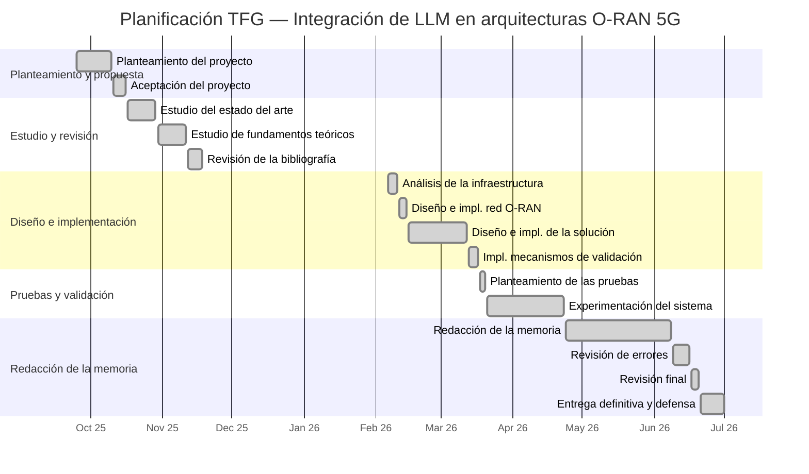

```mermaid
gantt
    title Planificación TFG — Integración de LLM en arquitecturas O-RAN 5G
    dateFormat DD-MM-YYYY
    axisFormat %b %y

    section Planteamiento y propuesta
        Planteamiento del proyecto          :done, des1, 25-09-2025, 10-10-2025
        Aceptación del proyecto             :done, des2, 11-10-2025, 16-10-2025

    section Estudio y revisión
        Estudio del estado del arte         :done, des3, 17-10-2025, 29-10-2025
        Estudio de fundamentos teóricos     :done, des4, 30-10-2025, 11-11-2025
        Revisión de la bibliografía         :done, des5, 12-11-2025, 18-11-2025

    section Diseño e implementación
        Análisis de la infraestructura      :done, des6, 06-02-2026, 10-02-2026
        Diseño e impl. red O-RAN            :done, des7, 11-02-2026, 14-02-2026
        Diseño e impl. de la solución       :done, des8, 15-02-2026, 12-03-2026
        Impl. mecanismos de validación      :done, des9, 13-03-2026, 17-03-2026

    section Pruebas y validación
        Planteamiento de las pruebas        :done, des10, 18-03-2026, 20-03-2026
        Experimentación del sistema         :done, des11, 21-03-2026, 23-04-2026

    section Redacción de la memoria
        Redacción de la memoria             :done, des12, 24-04-2026, 08-06-2026
        Revisión de errores                 :done, des13, 09-06-2026, 16-06-2026
        Revisión final                      :done, des14, 17-06-2026, 20-06-2026
        Entrega definitiva y defensa        :done, des15, 21-06-2026, 01-07-2026
```
